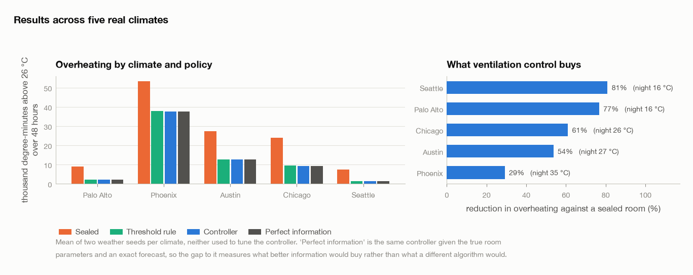
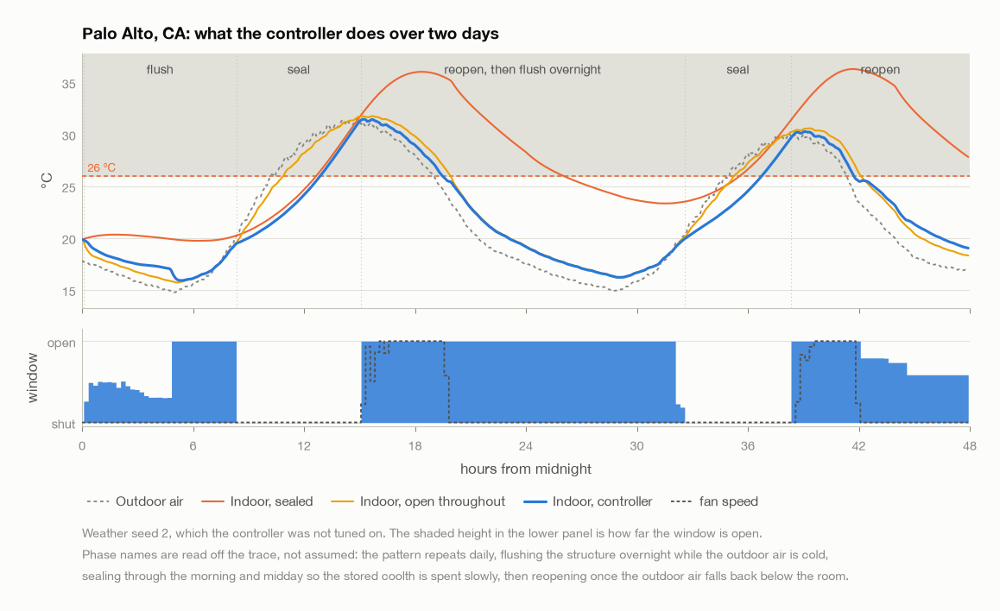
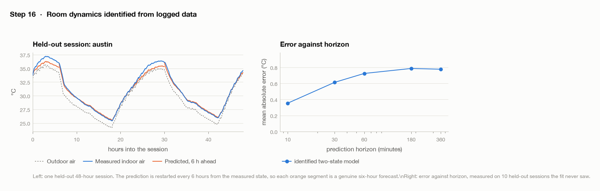
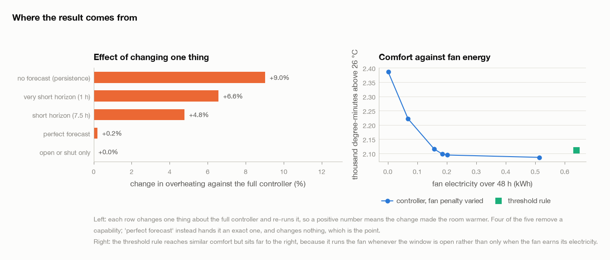
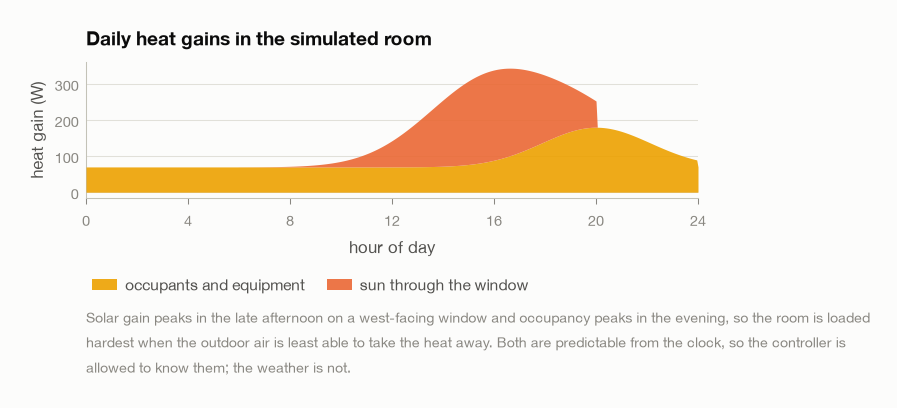
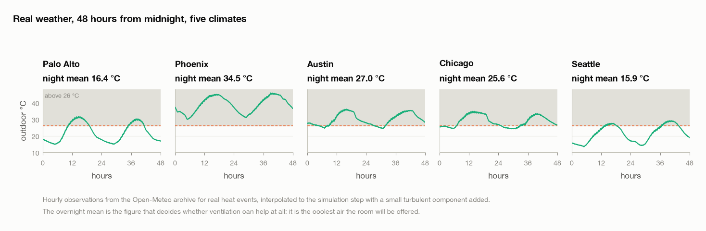

# WindWindow Sim

This simulates a bedroom in five real climates and asks whether opening and shutting the window at the right times can keep it cool through a heat wave with no air conditioning.

In the two climates with cool nights it cuts overheating by 81% and 77%. That number counts both how far above 26 °C the room goes and how long it stays there. The time spent above 26 °C falls from 22 hours to 12 out of 48. It comes within 0.7% of a controller that is given the exact weather in advance and the true room parameters.

I did not give the controller this strategy. It gets a comfort target and a 23-hour planning horizon, and it works the rest out on its own: open the window overnight to cool the walls and floor, keep it shut through the heat of the day, and open it again in the evening.

| | Result | Reference |
|---|---|---|
| **Overheating cut** | 81% | Seattle, WA. 5.2 times less than leaving the window shut |
| **Within** | 0.7% of optimal | measured against perfect forecast and exact room parameters, worst of five climates |
| **Fan electricity** | 42% less | than the best heuristic, at identical comfort (-0.5%) |
| **Screening rule** | r = -0.98 | one free measurement predicts whether it will work in a given climate |


## Results



*Five climates, two weather seeds each, 48 hours per run. Neither seed was used for tuning.*

| Climate | Night mean | Peak outdoor | Overheating cut | vs shut | Hours over 26, shut | Hours over 26, controller | Fan kWh |
|---|---|---|---|---|---|---|---|
| Palo Alto, CA | 16.4 | 31.6 | 77% | 4.3x | 25.8 | 11.5 | 0.19 |
| Phoenix, AZ | 34.5 | 45.8 | 29% | 1.4x | 48.0 | 48.0 | 0.87 |
| Austin, TX | 27.0 | 36.0 | 54% | 2.2x | 48.0 | 43.2 | 0.80 |
| Chicago, IL | 25.6 | 34.8 | 61% | 2.6x | 48.0 | 35.8 | 0.65 |
| Seattle, WA | 15.9 | 29.1 | 81% | 5.2x | 22.2 | 12.1 | 0.31 |

*48-hour runs. The last two columns are the same room left shut, then run by the controller.*


### One measurement predicts whether this will work

Across the five climates, how much the controller helps tracks the average overnight temperature at r = -0.98. So you can work out whether it is worth installing by leaving a thermometer outside for a week. This works because the controller cools the walls and floor at night and then lives off that stored cold during the day. If the nights are not cold, there is nothing to store and nothing to live off.

Phoenix, AZ is the climate where this does not work. Nights there average 35 °C, and the room stays above 26 °C for all 48 hours even when the controller is given perfect information. The 29% reduction it manages is real, but the room is still too warm to sleep in. If your nights are that warm, the money is better spent on insulation, shading or a heat pump, and a week with a thermometer will tell you which case you are in.


## What the controller does



*The controller opens up overnight to cool the structure, keeps the room shut through the morning and midday, then opens again once the outside air drops back below the indoor temperature.*

The controller is told to do three things: stay below 26 °C, stay above 17 °C, and keep down what it spends on fan electricity and on moving the window. None of that mentions night, day, or the walls. The controller plans the whole of the next day at once, and once it can see the coming afternoon, cooling the walls at 4 am turns out to be the cheapest way to get through it. That is where the daily rhythm in the figure comes from.

How far ahead the controller plans matters more than anything else I tuned. With a 7.5-hour horizon, a decision made at 2 am cannot see the following afternoon, so cooling the walls looks like a waste of fan power and the controller refuses to do it. At that horizon it loses to the simple rule of opening the window whenever it is cooler outside. Stretching the horizon to 23.5 hours is the one change that makes the night-cooling behaviour show up.

```
horizon 23.5 h in 12 blocks: 15, 15, 30, 30, 60, 60, 120, 120, 180, 240, 240, 300 min
minimise  degree-minutes over 26 degC
        + degree-minutes under 17 degC
        + 0.7 per watt-hour of fan
        + a small charge for moving the window
re-plan every 15 min, execute the first block only
```


## Comparison

| Policy | Degree-minutes over 26 °C | Hours over 26 °C | Worst peak | Fan kWh |
|---|---|---|---|---|
| Shut | 24242 | 38.4 | 53.0 | 0.00 |
| Open | 13704 | 32.1 | 46.5 | 0.00 |
| Timer, half the time | 13876 | 32.4 | 47.1 | 0.60 |
| Open when cooler outside | 12735 | 30.0 | 46.0 | 0.97 |
| **This controller** | 12669 | 30.1 | 46.1 | 0.56 |
| Perfect information | 12663 | 30.0 | 46.1 | 0.55 |

*Averaged over five climates and two seeds. The peak column is the worst single moment anywhere, so Phoenix dominates it.*

The rule to beat is simply opening the window whenever it is cooler outside than in. That rule gets some night cooling for free without anyone planning it, which makes it a hard baseline to improve on. On temperature the two finish level, within 0.5% of each other.

They differ in how much electricity they use. The simple rule turns the fan on whenever the window is open, because it has no way of weighing what the fan costs against what it achieves. The controller has the price of fan electricity written into its objective, so it only runs the fan when the extra cooling is worth the watt-hours. That works out to 42% less fan energy for the same indoor temperature.

| Climate | Heuristic, fan kWh | Controller, fan kWh | Saved | Comfort difference |
|---|---|---|---|---|
| Palo Alto, CA | 0.79 | 0.19 | 76% | +0.5% |
| Phoenix, AZ | 1.06 | 0.87 | 18% | -0.4% |
| Austin, TX | 1.16 | 0.80 | 31% | -0.2% |
| Chicago, IL | 1.08 | 0.65 | 40% | -1.5% |
| Seattle, WA | 0.75 | 0.31 | 59% | -0.2% |

*Negative comfort difference means the controller ran cooler. The saving is largest where the nights are coldest, because there the open window does the cooling on its own and the fan is barely needed.*


## Fitting the model

To plan ahead, the controller needs to know how the room behaves over the next several hours, not just what the temperature will be in ten minutes. So I fit ten numbers to the logged data: the heat capacities of the air and of the structure, and the conductances between them and the outside. The fit uses 20 logged 48-hour sessions across the five climates, and it minimises the error over multi-hour stretches rather than over single steps.

|  | Fitted | Actual | Off by |
|---|---|---|---|
| Air and furniture | 132 kJ/K | 146 kJ/K | -10% |
| Structure | 1.54 MJ/K | 1.50 MJ/K | +3% |
| Heat loss, window shut | 23.2 W/K | 21.9 W/K | +6% |
| Structural time constant | 7.5 h | 7.4 h | +0.5% |

*Median error across all ten parameters is 8%. The actual values are shown for comparison and took no part in the fit.*

The structural time constant comes back within 0.5% of its true value and the heat-loss coefficient within 6%, even though the sensors feeding the fit carry a 0.3 °C calibration offset and 0.1 °C of noise. All ten parameters come out inside their physically plausible ranges.

Forcing the fit to stay in physical units is what makes this work, and it is worth saying what happens when you do not. The two wall conductances cannot be told apart from the data, because the physics fixes their ratio to the ratio of the two heat capacities. When I left them free, the fit came back with a negative infiltration conductance and a structure 99% too light, and it still predicted the held-out sessions reasonably well. The trouble is that a model like that falls apart as soon as you ask it about an action the data never contained, and those are exactly the actions a planner wants to try out.

| Horizon | Mean error |
|---|---|
| 10 min | 0.35 °C |
| 30 min | 0.61 °C |
| 1 h | 0.72 °C |
| 3 h | 0.79 °C |
| 6 h | 0.78 °C |

*Ten held-out sessions. The room swings about 14 °C over a day, so the six-hour error is around 6% of that.*



*Prediction restarts every six hours from the measured state, so each segment is a genuine six-hour forecast.*


## Ablations



*Each row changes one thing and re-runs the whole evaluation. A positive cost means the room ran warmer than it did with the full controller.*

| Change | Degree-minutes | Cost |
|---|---|---|
| no forecast (persistence) | 2306 | +9.0% |
| perfect forecast | 2120 | +0.2% |
| short horizon (7.5 h) | 2216 | +4.8% |
| very short horizon (1 h) | 2254 | +6.6% |
| open or shut only | 2115 | +0.0% |

*Full controller: 2115 degree-minutes. Measured on Palo Alto, CA, the climate the fan penalty was tuned on.*

The controller needs a weather forecast, but it does not need an accurate one. Taking the forecast away, so that it has to assume the weather stays as it is now, costs 9%. Swapping the realistic forecast for a perfect one changes the result by only +0.2%, which is within the run-to-run noise. Nearly all of the useful information is in the daily rise and fall of the temperature, and a clock gives you that for nothing. So a free public forecast is enough, and there is no need for a weather station on site.


## The room

The room is a 4 by 3 by 2.5 m bedroom of medium-weight construction. It has one window that opens, a 25 W fan, people in it for part of the day, and afternoon sun falling on the glass.

The model tracks two temperatures: the air and furniture together, and the structure. The structure stores 1.5 MJ/K of heat, roughly 10 times as much as the air, and that store is what the whole strategy runs on. Cold you put into the walls at 4 am is still there at 3 pm.

```
[gains] --> ( indoor air ) <--> ( structure ) <--> outdoors
                  |
                  +------- window and fan -------> outdoors
```

|  | Value |  |
|---|---|---|
| Volume | 30 m³ |  |
| Air and furniture | 146 kJ/K | settles in an hour |
| Structure | 1.5 MJ/K | 7.4 h time constant |
| Heat loss, window shut | 21.9 W/K | envelope plus 0.8 air changes/h |
| Window open | 141 W/K | 14 air changes/h |
| Fan on top | 161 W/K | another 16 air changes/h |
| Heat gains | 156 W mean, 344 W peak | peak at 17:00 |



*Heat gains peak in the late afternoon, which is also when the outside air is too warm to carry the heat away. Timing matters because those two things do not line up.*

I checked the equations against hand calculations worked out separately: energy conservation, the closed-form matrix exponential solution, a resistance network derived independently, Newton's law of cooling in the single-mass limit, and the fitted time constants against the predicted ones. All six checks agree, the last of them to within 0.4%.


## Weather data



*Hourly observations from the Open-Meteo archive, real 2024 heat events. Cached in the repository so results reproduce offline.*

I picked five climates to cover the range a ventilation controller would actually meet. Phoenix, AZ averages 35 °C overnight and peaks at 46 °C, while Seattle and Palo Alto drop into the mid teens every night. That gap between them is what decides whether the controller has anything to work with.


## Usage

```
$ .venv/bin/python scripts/advise.py --location palo_alto

Ventilation advice for Palo Alto, CA
  outdoor 14.7 to 31.6 degC, overnight mean 16.4 degC

Recommended schedule
  Day 2
    00:00 - 08:05  open fully             outdoor  16.2 degC
    08:05 - 14:50  keep shut              outdoor  26.1 degC
    14:50 - 18:05  open fully, fan on     outdoor  27.7 degC
    18:05 - 24:00  open fully             outdoor  19.0 degC
```

`--lat` and `--lon` work for any point on Earth, fetching the weather on demand. Room dimensions, construction and heat gains are in `windwindow/config.py`.


## Limitations

- **One room geometry.** Medium-weight 30 m³ bedroom, west-facing window. A lightweight room has less structure to pre-cool, so it would gain less than this. All the room constants live in one file, so it would be easy to test.
- **Two weather seeds per climate, two days each.** That is enough to show the pattern is not an accident of one weather series, but not enough to put error bars on any of these numbers.
- **Sensor calibration offset is modelled, never corrected.** Each session draws a fixed 0.3 °C offset per sensor, shifting where the controller believes the threshold sits. A deployment would estimate and remove it; here every policy carries the same handicap.
- **Humidity is absent.** Austin's night air is warm and humid, and ventilating would import that moisture, so the gain shown there is optimistic.
- **No shading, shutters or occupancy learning.** Shading would do a similar job by keeping the heat out instead of flushing it out, and solar gain peaks at 344 W, so it would probably help a lot.
- **The heat-gain schedule is given to the controller.** Solar geometry is predictable and the occupancy pattern here is a coarse guess, so handing it over is defensible, but a real installation would have to learn the occupancy part from its own data.
- **The planner searches locally.** Bounded quasi-Newton from several starting schedules, keeping the best, with no guarantee of finding the global optimum. The perfect-information reference shows that all of this costs at most 0.7%.


## Running it

```
python3 -m venv .venv && .venv/bin/pip install -r requirements.txt
.venv/bin/python scripts/run_all.py          # all 14 steps
.venv/bin/python scripts/run_all.py 10 11    # just those two
.venv/bin/python scripts/advise.py --location seattle
```

Every step finishes with an acceptance check and exits non-zero if that check fails, and the driver stops at the first failure. The weather downloads once into `data/weather`, so everything after that runs offline. A full run takes 25 minutes, and nearly all of that is the two planning steps, which between them simulate about 140 room-days.

| Step | What it does | Check |
|---|---|---|
| 00 | Core invariants | 63 checks on physics, weather, sensors, features |
| 01 | Room model | sealed room warms smoothly to a limit |
| 02 | Verify the thermal model | six hand calculations agree |
| 03 | Synthetic weather | four scenarios generate and plot |
| 04 | Window and fan | cools when cooler out, warms when hotter |
| 05 | Sensor model | readings scatter around the truth, offsets persist |
| 06 | Simulator and logger | one run gives a complete CSV |
| 07 | Baselines | timer and threshold rule both run |
| 08 | Fetch real weather | five climates cached, 48 h or more each |
| 09 | Identification data | five climates, partial openings a third of rows |
| 10 | Fit the room | capacities and time constant recovered, parameters physical |
| 11 | Controller design | fan penalty selected, six variants run |
| 12 | Evaluate by climate | beats a sealed room in every climate |
| 13 | Figures and write-up | this page |

`REVAMP.md` records what changed from the first version of this project and why, including the mistakes worth knowing about.


## Files

```
windwindow/
  config.py       the room: sizes, capacities, conductances, gains
  room.py         two-mass thermal model, RK4 and an exact solver
  gains.py        occupants, equipment and sun, by clock time
  realweather.py  cached hourly observations, interpolated
  forecast.py     a forecast whose error grows with lead time
  statespace.py   ten physical parameters fitted to logged data
  mpc.py          the planning controller
  sensors.py      offset, lag, noise, quantisation
  policies.py     timer, threshold rule, fixed and random actions
  simulator.py    runs any policy under identical conditions
  doc.py          renders this write-up to Markdown and HTML
  report2.py      this write-up, built from the result tables
scripts/
  run_all.py      the pipeline, halting at the first failure
  advise.py       print a schedule for a place and a date
  legacy/         the retired first version
results/         13 figures, 8 tables
data/
  weather/        cached observations, committed
  identify/       logged fitting sessions, regenerated
  evaluate/       evaluation runs, regenerated
```

---

*Built from the result tables by `windwindow/report2.py`. Every number here is read out of a results file, so it can't drift from the code.*
